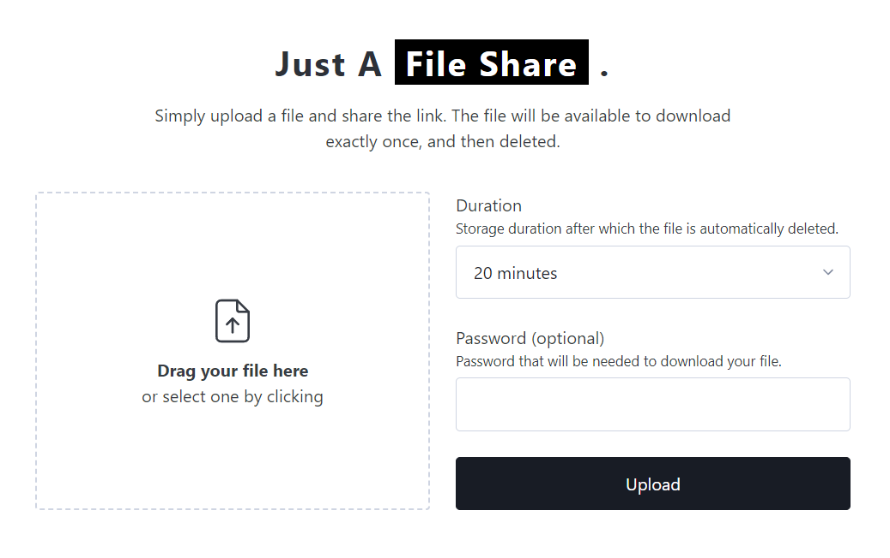

# go-share

Simple and fast encrypted one-time file sharing server developed in Go.



## What is this?

go-share is a minimalistic and fast file share for self-hosting. It serves a small web
application where a user can upload a single file. The file is stored encrypted on disk
until it is downloaded, after which the file gets deleted.

## Why?

This app is nothing revolutionary. Matter of fact, there are a lot better implementations,
that do not need to store any data at all and simply act as a secure proxy. But this app
is not supposed to be a commercial product, it was a personal project to:
- learn Go
- try out HTMX and AlpineJs
- learn Linux and server administration
- have a small file share for me and my friends
- finally have a finished project ;)
- have fun

## What now?

For me this project is finished. There is a lot that could be added, but I've got other
projects I want to work on.

What I would like to change:
- Migrate to a JSON API and use React or something similar for the frontend
- Either embrace the file storage idea or switch to an "encryption proxy"
- Improve UX with better error messages, internationalization and accessibility
- Make the app GDPR-compliant (it already mostly is as it does not process any user information)
- Add terms of service and other legal stuff
- Add tests for the http handlers
- Add docker image

## Installation

### Build the project

For Windows:

```bash
go env -w GOOS=windows GOARCH=amd64 | go build -ldflags "-s -w"
```

For Linux (Debian):

```bash
go env -w GOOS=linux GOARCH=amd64 | go build -ldflags "-s -w"
```

### Run the binary

Run the resulting binary.
The application uses these environment variables:

| Name                  | Description                                                   | Default                |
|-----------------------|---------------------------------------------------------------|------------------------|
| GOSHARE_HOST          | Host the app runs on, used when generating links and for CORS | http://localhost:8080/ |
| GOSHARE_MAX_FILE_SIZE | Max size for a single shared file in bytes                    | 104857600              |
| GOSHARE_DISK_SPACE    | Max allowed allocated size for all files on disk in bytes     | 32212254720            |
| GOSHARE_PORT          | Port the web server should run on                             | 8080                   |

### Alternative: Docker

Alternatively you can use the provided Dockerfile to build a Docker image.

```bash
docker build -t go-share .
docker run -p 8080:8080 go-share
```

The Docker image provides the same environment variables as the binary.

### Visit the app

Visit the app in your browser at `http://localhost:8080/`.

## HTMX

Initially this should have been a Go + HTMX Project, but after a month of work I had
to drop HTMX, and I have to say that this technology is so much more complicated to use
than ANY JavaScript library out there. The only good thing about it is that I don't need a
build step, but to be honest, I'd rather use Vue, Alpine, or literally anything else.

### My pain points:

##### HTML pollution

HTML is polluted with logic unrelated to the data, HTMX defends this in the name of
"collocation", but it's just a mess. You might initially be faster, but after some time,
it's just too much.

##### No easy way to add JavaScript

You cannot avoid JavaScript. There is no way to avoid "javascript fatigue", and there is
no way to access "modern browser features" without JavaScript in HTMX. Hell, you can't
even access normal browser features. More on that later.  
The only JavaScript I got to avoid was for the download indicator, which was nice.

##### UX

HTMX might be nice for applications like admin dashboards where you simply look at static
data and have minor interactions with it, but if you want (for example) client-side form
validations, you have to do it in JavaScript, and by collocating that logic, you just have
a huge ugly block of boilerplate in the middle of your markup, which makes it
unnecessarily hard to read.

The "right way" to do validation logic in HTMX is to send the users data to the server
and render the page again with the error messages inside of it. Adding a new handler to
the server, and slowing down the client by forcing unnecessary roundtrips to the server
for something that could have been done with a few lines of JavaScript.

##### HTMX lock-in

You cannot "just add HTMX", your whole application needs to build on top of it.

You lock your server into a proprietary library's format and architectural decisions.

##### No standard markup

The HTMX attributes do not follow HTML's naming conventions (enctype = hx-encoding,
also: why are they not "data-" attributes?). So you can't just use HTML. You have to use
HTMX.

##### Hard to implement

In my opinion it makes it unnecessarily hard to implement the server, except from a
single Python library, there is pretty much no integration between HTMX and the server.
Things like handling full page renders need to be handled by you. The syntax for this in
Go is pretty weird, and won't scale well.  
This also caused random template handlers everywhere, one is a page, one is a template,
one is both, it's hard to keep track of.

Business and ui logic intermingle on the server side. I didn't have to need to handle
HTMXs headers, but in one case I would've needed it. I would've needed to add a new layer
to abstract those two layers, which I'm just not willing to do for something as simple as
an error page.

There is no separation of concerns for the ui and data. Testing this is harder than just
checking some JSON data.

##### Hard to read

To understand what's going on you always need to read the whole page's markup, which is
unnecessarily difficult, because everything is hidden in different template files.

##### Not reusable

You cannot reuse your backend for some other project, or UI. You will need to create a
separate JSON-API at which point you pretty much lost any reason to use HTMX.

In my case, I actually would've actually liked for users to have the ability to just use
the api outright, but I had to scrap that feature due to HTMX. It still somewhat works,
but it isn't pretty.

##### Small feature-set

Every slightly more complex feature on the frontend needs another library, which adds
complexity and increases load times. Using plain JavaScript for everything just takes too
long.

You are really limited when it comes to the frontend.

##### Reinvented basic browser features

And the straw that broke the camel's back: Downloads don't work. HTMX does not handle
the Content-Disposition header. Considering HTMX markets itself like a superset for HTML
this is just unacceptable. I already had to customize HTMX multiple times to work the way
I needed it to, I had to cut features, because I simply couldn't implement them (without
adding a huge amount of complexity), and my application isn't that large or complex.

### What I like

- Fast load times for the user, but tbh. a Svelte application would probably be of the
  same size if not smaller.
- Mostly just markup, no framework, no build step.
- Fast prototyping.
- I learned a lot about how HTML behaves, what it can do, and what it can't do.
- Very good Google Lighthouse score.

### Personal opinion

- I find it harder to understand what happens, especially in error cases.
- You either have a huge HTML, or a huge amount of template files which are hard to keep
  track of.
- Combining markup, styles and logic in a single file makes them completely unreadable.
- You need to know the whole markup of the application to understand how it works, there
  is no api.
- Creating production-ready HTMX is really difficult.

### Conclusion

I've read a lot of opinions and articles online, many of them saying that using HTMX makes
their live a lot easier, maybe I'm just too stupid to use it properly, but I just don't
see it, no matter how I look at it. I forced myself to finish the project with HTMX, but
after the main feature of my app simply wouldn't work, I had to switch. The whole time I
was programming I just felt like I was doing something wrong. It just wasn't simple,
clean, or easier than any other JavaScript library. It limited me, made the development
process slow, wasn't fun, and just didn't create what I would consider "good code". In
contrary, it created markup littered with random snippets of JavaScript, random "hx-"
attributes and expressions from GOs templating syntax.
A lot of times I already had a solution in my head for how I would do it using a web
framework, just to find out that in HTMX I had to touch half my application to get
something simple to work.

It might actually be a mind-set thing. Maybe the way to do things in HTMX is just so
different from the way I used to do things, that even after using it for a month it just
didn't click. If I for example had known, that validation requires me to render the
template multiple times, I would have just immediately implemented it that way, and be
done with it.
I wouldn't be happy about it, but I would've been done.

I also had a look at alternatives like Unpoly, Turbo-Frames, and Alpine-AJAX, but they
suffer from some of the same limitations.

Personally I think modern SSR is a lot easier with Frameworks like Next or Remix, but in
my case a SPA is the easiest to develop, and at this scale, has pretty much no drawbacks.
